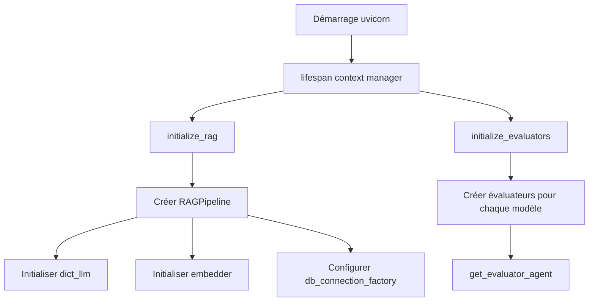
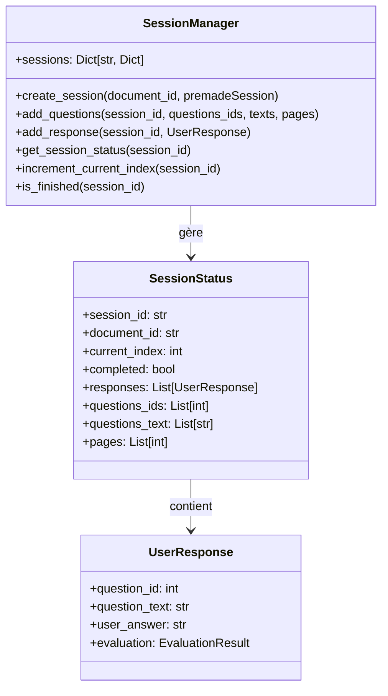
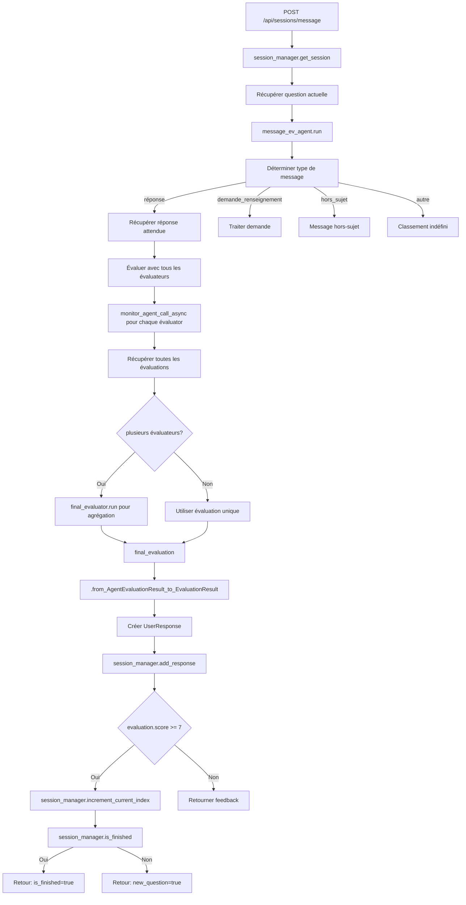
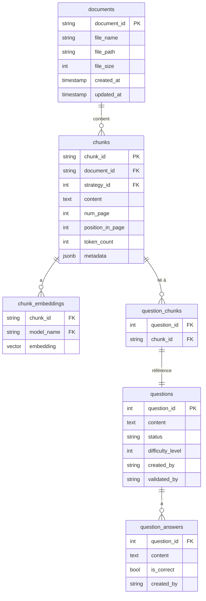

# 📄 LLMAgents - Système de Questions/Réponses sur Documents

*Note: README généré par IA, en cours de validation...*

**Version** : 0.1.0  
**Auteur** : Obaul  
---

## 📋 Table des Matières

1. [Description Générale](#-description-générale)
2. [Fonctionnalités Principales](#-fonctionnalités-principales)
3. [Interface Web](#-interface-web)
4. [Flux Utilisateur](#-flux-utilisateur)
5. [Configuration Requise](#⚙️-configuration-requise)
6. [Endpoints API](#-endpoints-api)
7. [Architecture Technique](#-architecture-technique)
8. [Pipeline de Fonctionnement](#-pipeline-de-fonctionnement)
9. [Gestion des Sessions](#-gestion-des-sessions)
10. [Base de Données](#-base-de-données)
11. [Agents LLM](#-agents-llm)
12. [Déploiement](#-déploiement)
13. [Technologies Utilisées](#-technologies-utilisées)
14. [Améliorations Futures](#-améliorations-futures)

---

## 📌 Description Générale

**LLMAgents** est une application web permettant aux utilisateurs de poser des questions sur des documents PDF et d'obtenir des réponses intelligentes générées par des modèles de langage (LLM) avec des sources précises et vérifiables.

Le système implique deux modes d'interaction principaux :

- **🤖 ChatBot RAG** (`m3c-chatbot.html`) : Permet de poser des questions libres sur un corpus de documents avec récupération automatique des sources pertinentes (RAG - Retrieval Augmented Generation)
- **📚 Chatbot Inversé M3C** (`pdf_chat_interface.html`) : Propose une session guidée avec des questions prédéfinies pour évaluer la compréhension d'un document spécifique.

---

## ✨ Fonctionnalités Principales

### 🔍 Recherche et Réponse
- **RAG (Retrieval Augmented Generation)** : Combinaison de recherche de documents similaires et génération de réponse par LLM
- **Similarité cosinus** : Calcul de pertinence entre la question et les chunks de documents
- **Reranking BM25+** : Amélioration du classement des sources trouvées
- **Citation des sources** : Chaque réponse inclut les références précises aux documents sources

### 📄 Gestion des Documents
- Liste des documents disponibles depuis la base de données
- Visualisation intégrée des PDF
- Navigation par pages
- Métadonnées des documents (taille, date de création, etc.)

### 💬 Interface de Chat
- Conversation en temps réel
- Support du Markdown dans les réponses
- Affichage des métriques (modèle utilisé, temps de réponse, tokens consommés, énergie)
- Historique de conversation

### 📊 Évaluation des Réponses (Mode Session)
- Questions prédéfinies par document
- Évaluation automatique des réponses utilisateurs
- Scoring et feedback détaillé
- Suivi de la progression

---

## 🖥️ Interface Web

### Structure de l'Interface (`pdf_chat_interface.html`)

```
┌─────────────────────────────────────────────────────────────────────┐
│  📁 Documents disponibles                    │  📄 Document PDF          │  🤖 Chatbot Inversé M3C  │
│  ───────────────────────────────            │  ───────────────────────  │  ───────────────────────  │
│  · Document 1                                │  [PDF Viewer]             │  📚 Système Q/R         │
│  · Document 2                              │  iframe                   │  documents                │
│  · Document 3                              │                            │                           │
│  · ...                                       │  ← Retour à la liste      │  ───────────────────────  │
│                                             │                            │  [Historique chat]        │
│                                             │                            │  ───────────────────────  │
│                                             │                            │  [Question]               │
│                                             │                            │  [Envoyer] ✓             │
└─────────────────────────────────────────────────────────────────────┘
```

### Composants Principaux

#### 1. Sélecteur de Documents (Colonne de gauche)
- **Fonctionnalité** : Affiche la liste de tous les documents disponibles
- **Source des données** : GET `/api/documents`
- **Éléments** :
  - Nom du document
  - Taille et date de création
  - Indicateur de chargement

#### 2. Visualiseur PDF (Centre)
- **Fonctionnalité** : Affiche le PDF sélectionné
- **Technologie** : iframe avec lien vers `/get_pdf?source_file={id}`
- **Navigation** : Navigation native du visualiseur PDF du navigateur

#### 3. Chat Interface (Colonne de droite)
- **En-tête** : Titre et description du système
- **Zone de chat** : Historique des messages (utilisateur + bot)
- **Entrée utilisateur** : Champ de texte avec validation sur Entrée
- **Bouton Envoyer** : Déclenche la requête API

---

## 🎯 Flux Utilisateur Typique

### Cas 1 : Question Libre (RAG)

```mermaid
graph TD
    A[Accueil] --> B[Sélectionner un document]
    B --> C[Affiche PDF dans visualiseur]
    C --> D[Poser une question dans le chat]
    D --> E[Requête POST /api/query/rag]
    E --> F[Backend traite la requête]
    F --> G[Retourne réponse + sources]
    G --> H[Afficher réponse avec sources cliquables]
    H --> I[Cliquer "Afficher le PDF" pour voir la source]
    I --> J[Ouvre PDF à la page indiquée]
```

### Cas 2 : Session Guidée (Chatbot Inversé)

```mermaid
graph TD
    A[Accueil] --> B[Sélectionner un document]
    B --> C[POST /api/sessions/init/{doc_id}]
    C --> D[Reçoit questions prédéfinies]
    D --> E[Afficher 1ère question]
    E --> F[Utilisateur répond]
    F --> G[POST /api/sessions/message]
    G --> H[Évaluation de la réponse]
    H --> I{Score ≥ 7?}
    I -->|Oui| J[Passer à la question suivante]
    I -->|Non| K[Afficher feedback]
    J --> L[Session terminée?]
    L -->|Oui| M[Export possible]
    L -->|Non| E
```

---

## ⚙️ Configuration Requise

### Prérequis

- **Python** : 3.12
- **PostgreSQL** : 15+ avec extension `pgvector`
- **Node.js** : Optionnel (pour développement frontend)
- **Ollama** : Optionnel (pour modèles locaux)

### Variables d'Environnement

Créer un fichier `.env` à la racine du projet :

```bash
# Clés API pour les modèles de langage
MISTRAL_API_KEY=votre_clé_mistral
GEMINI_API_KEY=votre_clé_gemini  # Optionnel

# Configuration du serveur API (optionnel)
API_HOST=0.0.0.0
API_PORT=8000
```

### Installation des Dépendances

```bash
# Depuis le dossier app
pip install -r requirements.txt
```

**Principales dépendances** :
- `fastapi` : Framework backend
- `uvicorn` : Serveur ASGI
- `langchain` : Orchestration LLM
- `langchain-mistralai` : Intégration Mistral
- `psycopg` : Client PostgreSQL async
- `rank-bm25` : Algorithme de reranking
- `pynvml` : Monitoring GPU (pour Ollama)

---

## 📡 Endpoints API

### 🏠 Root

| Méthode | Endpoint | Description |
|---------|----------|-------------|
| GET | `/` | Informations générales sur l'API |

### 💓 Health Check

| Méthode | Endpoint | Description | Réponse |
|---------|----------|-------------|---------|
| GET | `/api/health` | Vérifie l'état du serveur | `HealthResponse` |

**Exemple de réponse** :
```json
{
  "status": "healthy",
  "rag_initialized": true,
  "timestamp": "2024-05-20T14:30:45.123",
  "version": "0.1.0"
}
```

### 📄 Documents

| Méthode | Endpoint | Description | Réponse |
|---------|----------|-------------|---------|
| GET | `/api/documents` | Liste tous les documents | `DocumentsListResponse` |
| GET | `/get_pdf?source_file={id}` | Récupère un PDF | `FileResponse` |

**Exemple de requête** :
```bash
curl http://localhost:8000/api/documents
```

**Exemple de réponse** :
```json
{
  "documents": [
    {
      "document_id": "dbd5f14a9e6545880b0cd505583ea7d1fe1e8b3d",
      "file_name": "document_m3c.pdf",
      "file_path": "/documents/document_m3c.pdf",
      "file_size": 1024000,
      "created_at": "2024-01-15T10:00:00",
      "updated_at": "2024-01-15T10:00:00"
    }
  ],
  "count": 1,
  "timestamp": "2024-05-20T14:30:45.123"
}
```

### 💬 Questions / Réponses

| Méthode | Endpoint | Description | Requête | Réponse |
|---------|----------|-------------|---------|---------|
| POST | `/api/query/simple` | Question simple (sans RAG) | `QueryRequest` | `QueryResponse` |
| POST | `/api/query/rag` | Question avec RAG | `QueryRequest` | `QueryResponse` |
| POST | `/api/query/compare` | Compare plusieurs modèles | `QueryRequest` | `QueryCompareResponse` |

**Modèle `QueryRequest`** :
```json
{
  "question": "Quelle est la méthode de découpage utilisée ?",
  "models": ["mistral-small"],
  "k": 3,
  "use_rag": true,
  "use_reranking": true,
  "include_quantitative": true
}
```

**Modèle `QueryResponse`** :
```json
{
  "answer": "La méthode utilise des chunks de 2700 caractères avec overlap de 400...",
  "sources": [
    {
      "content": "Le document est découpé en chunks de 2700 caractères...",
      "score_cossim": 0.923,
      "score_bm25": 12.45,
      "metadata": {
        "chunk_id": "dbd5f14a-12",
        "document_id": "dbd5f14a9e6545880b0cd505583ea7d1fe1e8b3d",
        "num_page": 5,
        "document_data": {
          "file_name": "document_m3c.pdf"
        }
      }
    }
  ],
  "total_time": 2.34,
  "metadata": {
    "model": "mistral-small",
    "k": 3,
    "use_reranking": true,
    "num_sources": 3,
    "token_usage": {
      "input_tokens": 944,
      "output_tokens": 686
    },
    "consumed_energy_Wh": 0.0012
  },
  "timestamp": "2024-05-20T14:30:45.123"
}
```

### 📋 Sessions (Mode Chatbot Inversé)

| Méthode | Endpoint | Description | Requête | Réponse |
|---------|----------|-------------|---------|---------|
| POST | `/api/sessions/init/{document_id}` | Initialise une session | `premade_session: bool` | `SessionStatus` |
| POST | `/api/sessions/message` | Soumet une réponse | `SessionMessage` | `SessionResponse` |
| GET | `/api/sessions/{session_id}` | Récupère l'état | - | `SessionStatus` |
| GET | `/api/sessions/export/{session_id}` | Exporte en CSV | - | `JSONResponse` |

**Modèle `SessionMessage`** :
```json
{
  "session_id": "550e8400-e29b-41d4-a716-446655440000",
  "user_message": "La réponse à la question..."
}
```

**Modèle `SessionResponse`** :
```json
{
  "session_status": { /* SessionStatus */ },
  "computed_message_type": "réponse",
  "message": "Très bonne réponse ! Passons à la question suivante.",
  "new_question": true,
  "is_finished": false,
  "total_time": 1.23,
  "metadata": {
    "token_usage": {
      "input_tokens": 512,
      "output_tokens": 256
    }
  }
}
```

---

## 🏗️ Architecture Technique

### Diagramme Global

```mermaid
graph TD
    subgraph Client["Frontend (HTML/JS)"]
        A[pdf_chat_interface.html] -->|Requête| B[chatFunctions.js]
        A --> C[m3c-chatbot.html]
        B -->|fetch| D[api_server.py]
    end

    subgraph Server["Backend (FastAPI)"]
        D -->|route| E[/api/query/rag]
        D --> F[/api/sessions/*]
        D --> G[/api/documents]
        E --> H[rag_pipeline.py]
        F --> I[question_session.py]
        H --> J[database.py]
        H --> K[LLM Clients]
        I --> K
    end

    subgraph LLM["Modèles de Langage"]
        K --> L[Mistral AI API]
        K --> M[Gemini API]
        K --> N[Ollama Local]
    end

    subgraph DB["Base de Données"]
        J --> O[(PostgreSQL + pgvector)]
    end
```

---

## 🔧 Pipeline de Fonctionnement

### 1. Initialisation au Démarrage



**Code** (`api_server.py`) :
```python
@asynccontextmanager
async def lifespan(app: FastAPI):
    # Startup
    initialize_rag()
    initialize_evaluators()
    yield
    # Shutdown : sauvegarde des sessions
```

### 2. Traitement d'une Question (Flux RAG)

```mermaid
graph TD
    A[Requête utilisateur] --> B[api_server.py:query_rag]
    B --> C[rag_pipeline:query_rag]
    C --> D{final_prompt & sources fournis?}
    D -->|Non| E[rag_pipeline:rag_preprocess]
    D -->|Oui| F[rag_pipeline:query_simple]
    
    E --> G[_get_prompt_embeddings]
    G --> H[MistralAIEmbeddings.embed_query]
    E --> I[_retrieve_top_k_chunks_from_db]
    I --> J[database.get_top_k_similar_chunks_cossim]
    I --> K[Requête SQL avec pgvector]
    E --> L[rereank avec BM25+]
    L --> M[rank_bm25.BM25Plus]
    E --> N[_build_augmented_prompt]
    N --> O[Formatage avec template RAG]
    
    F --> P[_invoke_llm]
    P --> Q[dict_llm[model].ainvoke]
    Q --> R[ChatMistralAI / ChatGoogleGenerativeAI / ChatOllama]
    P --> S[Mesurer temps et énergie]
    
    F --> T[Retour: answer, sources, time, energy]
    C --> T
    B --> U[_build_query_rag_response]
    U --> V[Formater QueryResponse]
    V --> W[Retour au client]
```

**Code détaillé** (`rag_pipeline.py`) :

```python
async def query_rag(self, prompt: str, model: str, reranking: Optional[str], k: int = 3) -> tuple:
    # 1. Prétraitement RAG
    final_prompt, sources = await self.rag_preprocess(prompt, reranking, k)
    
    # 2. Requête LLM
    answer, total_time, consumed_energy = await self.query_simple(final_prompt, model)
    
    # 3. Retour
    return answer, sources, total_time, consumed_energy

async def rag_preprocess(self, prompt: str, reranking: Optional[str], k: int = 3):
    # 1. Embedding du prompt
    prompt_embeddings = self._get_prompt_embeddings(prompt)
    
    # 2. Récupération des chunks similaires (8*k pour le reranking)
    top_k_chunks = await self._retrieve_top_k_chunks_from_db(
        prompt_embeddings, 
        int(self.rag_rerank_ndocs_coeff * k)
    )
    
    # 3. Reranking (optionnel)
    if reranking:
        self.rerank(top_k_chunks, prompt, k, method=reranking)
    
    # 4. Construction du prompt enrichi
    augmented_prompt = self._build_augmented_prompt(prompt, top_k_chunks[:k])
    
    return augmented_prompt, top_k_chunks[:k]
```

### 3. Requête SQL pour la Recherche RAG

```sql
-- database.py : get_top_k_similar_chunks_cossim()
SELECT 
    c.chunk_id,
    c.document_id,
    c.content,
    c.num_page,
    c.position_in_page,
    c.token_count,
    c.metadata,
    1 - (ce.embedding <=> %s::vector) AS similarity
FROM chunk_embeddings ce
JOIN chunks c ON ce.chunk_id = c.chunk_id
WHERE ce.model_name = %s
ORDER BY similarity DESC
LIMIT %s;
```

### 4. Appel au LLM

```python
async def _invoke_llm(self, model: str, prompt: str) -> tuple:
    consumed_energy = 0
    start = time.time()
    
    # Mesure énergie pour Ollama (local)
    if model in OLLAMA_MODELS:
        pynvml.nvmlInit()
        handle = pynvml.nvmlDeviceGetHandleByIndex(0)
        start_energy = pynvml.nvmlDeviceGetTotalEnergyConsumption(handle)
    
    # Appel au modèle
    answer = await self.dict_llm[model].ainvoke(prompt)
    elapsed_time = time.time() - start
    
    # Calcul énergie consommée
    if model in OLLAMA_MODELS:
        torch.cuda.synchronize()
        consumed_energy = (pynvml.nvmlDeviceGetTotalEnergyConsumption(handle) - start_energy) / (1000 * 3600)
    
    return answer, elapsed_time, consumed_energy
```

---

## 🎓 Gestion des Sessions

### Architecture des Sessions



### Flux de Traitement d'une Réponse Utilisateur



**Code** (`api_server.py`) :

```python
@app.post("/api/sessions/message")
async def submit_message(request: SessionMessage):
    # 1. Récupération de la session et question actuelle
    session = session_manager.get_session(request.session_id)
    current_question_id = session_manager.get_current_question_id(request.session_id)
    question = await get_question_by_id(await get_db_connection(), current_question_id, include_answers=True)
    
    # 2. Détermination du type de message
    result = await monitor_agent_call(
        message_ev_agent,
        user_input=MessageTypeRequestInput(
            current_question=question["content"],
            user_message=request.user_message
        ),
        method="run"
    )
    message_type = result.message_type
    
    # 3. Traitement selon le type
    if message_type == "réponse":
        # Évaluation par tous les évaluateurs
        evaluations = []
        coroutines = [
            monitor_agent_call_async(evaluator, EvaluateRequestInput(...), "run_async")
            for evaluator in evaluators
        ]
        eval_results = await asyncio.gather(*coroutines)
        
        # Agrégation si plusieurs évaluateurs
        if len(eval_results) > 1:
            final_evaluation = final_evaluator.run(ListAgentEvaluationResult(evaluations=[e[0] for e in eval_results]))
        else:
            final_evaluation = eval_results[0][0]
        
        # Création de la réponse utilisateur
        user_response = UserResponse(
            question_id=current_question_id,
            question_text=question['content'],
            user_answer=request.user_message,
            date_sent=datetime.now(),
            evaluation=from_AgentEvaluationResult_to_EvaluationResult(final_evaluation)
        )
        
        session_manager.add_response(request.session_id, user_response)
        
        # Passage à la question suivante si score suffisant
        if evaluation_result.score >= 7:
            session_manager.increment_current_index(request.session_id)
```

---

## 🗃️ Base de Données

### Schéma Principal



### Tables Importantes

| Table | Description | Champs Clés |
|-------|-------------|-------------|
| `documents` | Métadonnées des documents PDF | `document_id`, `file_name`, `file_path`, `file_size` |
| `chunks` | Fragments de documents | `chunk_id`, `document_id`, `content`, `num_page`, `token_count` |
| `chunk_embeddings` | Vecteurs d'embedding | `chunk_id`, `model_name`, `embedding` (type vector) |
| `questions` | Questions générées | `question_id`, `content`, `status`, `difficulty_level` |
| `question_answers` | Réponses aux questions | `question_id`, `content`, `is_correct` |

### Index Importants

```sql
-- Pour la recherche RAG rapide
CREATE INDEX idx_chunk_embeddings_model ON chunk_embeddings(model_name);
CREATE INDEX idx_chunk_embeddings_chunk ON chunk_embeddings(chunk_id);

-- Pour les jointures
CREATE INDEX idx_chunks_document ON chunks(document_id);
CREATE INDEX idx_question_chunks_question ON question_chunks(question_id);
CREATE INDEX idx_question_chunks_chunk ON question_chunks(chunk_id);
```

---

## 🤖 Agents LLM

### Liste des Agents

| Fichier | Agent | Rôle | Modèle par défaut |
|--------|-------|------|------------------|
| `agents/qa_agent.py` | `AtomicAgent` | Génération Q&A | mistral-medium |
| `agents/answer_evaluator_agent.py` | `get_evaluator_agent` | Évaluation des réponses | ministral-8b-latest |
| `agents/final_evaluator_agent.py` | `get_final_evaluator_agent` | Agrégation des évaluations | mistral-small |
| `agents/message_evaluator_agent.py` | `get_message_type_agent` | Classification des messages | mistral-small |
| `agents/mistral_client.py` | `get_mistral_client` | Client Mistral AI | - |
| `agents/ollama_client.py` | `get_ollama_client` | Client Ollama | - |

### Structure d'un Agent (Exemple: `answer_evaluator_agent.py`)

```python
from atomic_agents import AtomicAgent, AgentConfig, BaseIOSchema

class EvaluateRequestInput(BaseIOSchema):
    """Entrée pour l'évaluation d'une réponse"""
    question: str
    expected_answer: str
    user_answer: str

class AgentEvaluationResult(BaseIOSchema):
    """Résultat de l'évaluation"""
    score: int          # 0-10
    feedback: str       # Commentaires
    explanation: str   # Justification détaillée
    cosine_similarity: float  # Similarité avec la réponse attendue

def get_evaluator_agent(model: str, provider: str = "mistral", async_mode: bool = True):
    """
    Crée un agent spécialisé dans l'évaluation de réponses.
    Utilise un prompt système pour guider l'évaluation.
    """
    system_prompt = """
    Tu es un expert en évaluation de réponses. 
    Ton rôle est d'évaluer la réponse de l'utilisateur par rapport à la réponse attendue.
    
    Critères d'évaluation:
    1. Exactitude : La réponse est-elle correcte ?
    2. Complétude : La réponse couvre-t-elle tous les aspects ?
    3. Clarté : La réponse est-elle bien formulée ?
    
    Retourne toujours un score entre 0 et 10.
    """
    
    client = get_mistral_client() if provider == "mistral" else get_ollama_client()
    
    agent = AtomicAgent[EvaluateRequestInput, AgentEvaluationResult](
        config=AgentConfig(
            client=client,
            model=model,
            system_prompt=system_prompt,
            history=ChatHistory()
        )
    )
    return agent
```

---

## 🚀 Déploiement

### Structure du Projet

```
LLMAgents-These/
├── static/                          # Frontend
│   ├── pdf_chat_interface.html      # Interface principale (RAG + PDF)
│   ├── m3c-chatbot.html             # Interface alternative (RAG seul)
│   ├── chatFunctions.js             # Logique JavaScript du chat
│   ├── style.css                   # Styles CSS
│   └── test-mediation.js            # Tests frontend
│
├── api_server.py                   # Serveur FastAPI (point d'entrée)
├── rag_pipeline.py                 # Pipeline RAG principal
├── question_session.py             # Gestion des sessions guidées
├── helper.py                       # Fonctions utilitaires
│
├── agents/                         # Agents LLM spécialisés
│   ├── __init__.py
│   ├── answer_evaluator_agent.py    # Évaluation des réponses
│   ├── final_evaluator_agent.py    # Agrégation des évaluations
│   ├── message_evaluator_agent.py  # Classification des messages
│   ├── qa_agent.py                  # Génération Q&A
│   ├── mistral_client.py           # Client Mistral AI
│   ├── ollama_client.py            # Client Ollama
│   └── token_monitor.py            # Monitoring des tokens
│
├── database/                       # Couche base de données
│   ├── __init__.py
│   ├── database.py                 # Requêtes SQL
│   └── create_*.sql                 # Scripts de création de tables
│
├── embeddings/                     # (Optionnel) Stockage des embeddings
├── documents/                      # Stockage des PDF
└── old/                           # Code obsolète
```

### Procédure de Déploiement

#### 1. Configuration de la Base de Données

```bash
# Connexion à PostgreSQL
psql -U postgres

# Créer la base de données
CREATE DATABASE mediationllm;

# Activer l'extension pgvector
\c mediationllm
CREATE EXTENSION IF NOT EXISTS vector;

# Exécuter les scripts de création de tables
\i database/create_tables_1st_iteration.sql
\i database/create_user_question_tables.sql
```

#### 2. Peuplement de la Base

```bash
# Créer des embeddings pour les documents
python scripts/create_embeddings.py

# LittleLemmy/ChromaDB pour stocker les embeddings (optionnel)
# ou directement dans PostgreSQL avec pgvector
```

#### 3. Lancer le Serveur

```bash
# Depuis app/
uvicorn api_server:app --reload --port 8000

# Ou avec les variables d'environnement
MISTRAL_API_KEY=votre_cle uvicorn api_server:app --host 0.0.0.0 --port 8000
```

#### 4. Accéder à l'Application

- **Documentation API** : http://localhost:8000/docs
- **Interface PDF** : Ouvrir `static/pdf_chat_interface.html` dans un navigateur
- **Interface RAG** : Ouvrir `static/m3c-chatbot.html` dans un navigateur

#### 5. Servir le Frontend (Option 1 : Simple)

```bash
# Depuis app/static
python -m http.server 8001
# Accéder à http://localhost:8001/pdf_chat_interface.html
```

#### 6. Servir le Frontend (Option 2 : Intégration FastAPI)

Modifier `api_server.py` pour servir les fichiers statiques :

```python
from fastapi.staticfiles import StaticFiles

app.mount("/static", StaticFiles(directory="static"), name="static")
```

Puis accéder directement à : http://localhost:8000/static/pdf_chat_interface.html

---

## 🛠️ Technologies Utilisées

### Frontend

| Technologie | Version | Usage |
|-------------|---------|-------|
| **HTML5** | - | Structure des pages |
| **CSS3** | - | Styles et mise en page |
| **JavaScript ES6+** | - | Logique client |
| **marked.js** | Latest | Rendering Markdown |

### Backend

| Technologie | Version | Usage |
|-------------|---------|-------|
| **Python** | 3.10+ | Langage principal |
| **FastAPI** | Latest | Framework web |
| **Uvicorn** | Latest | Serveur ASGI |
| **LangChain** | Latest | Orchestration LLM |
| **Pydantic** | v2 | Validation des données |

### LLM & Embeddings

| Service | Usage |
|---------|-------|
| **Mistral AI API** | Modèles principaux (mistral-small, mistral-medium, etc.) |
| **Google Gemini API** | Alternative (optionnelle) |
| **Ollama** | Modèles locaux (ministral-8b, etc.) |
| **Mistral Embeddings** | Génération des embeddings (`mistral-embed`) |

### Base de Données

| Technologie | Version | Usage |
|-------------|---------|-------|
| **PostgreSQL** | 15+ | Stockage des documents et chunks |
| **pgvector** | Latest | Extension pour la similarité vectorielle |
| **psycopg** | Latest | Client PostgreSQL async |

### Autres

| Bibliothèque | Usage |
|-------------|-------|
| **rank-bm25** | Reranking des résultats |
| **pynvml** | Monitoring GPU (consommation énergie) |
| **torch** | Support CUDA pour Ollama |
| **python-dotenv** | Gestion des variables d'environnement |

---

## 🎯 Améliorations Futures

### 🚀 Fonctionnalités à Ajouter

| Priorité | Fonctionnalité | Description |
|----------|---------------|-------------|
| ⭐⭐⭐ | Persistance des sessions | Sauvegarder les sessions en base de données |
| ⭐⭐⭐ | Upload de documents | Permettre aux utilisateurs d'uploader leurs propres PDF |
| ⭐⭐ | Cache des embeddings | Éviter de recalculer les embeddings |
| ⭐⭐ | Authentification | Système de login (JWT, OAuth) |
| ⭐ | Version mobile | Responsive design pour smartphones |
| ⭐ | Historique des conversations | Sauvegarder et retrouver les chats |
| ⭐ | Export avancé | PDF, JSON en plus du CSV |
| ⭐ | Multi-langues | Support de plusieurs langues |

### 🔧 Optimisations Techniques

| Problème | Solution |
|----------|----------|
| Sessions en mémoire RAM | Utiliser Redis pour la persistance |
| Modèles payants | Intégrer plus de modèles Ollama gratuit |
| Recherche linéaire | Index FAISS ou Weaviate pour scalabilité |
| Latence LLM | Cache des réponses fréquentes |
| Interface basique | Migration vers React/Vue |

### 📊 Métriques à Ajouter

- Statistiques d'utilisation par utilisateur
- Temps moyen de réponse par modèle
- Coût estimé des requêtes API
- Précision des évaluations

---

## 📞 Support et Contribution

Pour toute question, problème ou suggestion d'amélioration :

- Ouvrir une issue sur le dépôt Git
- Contribuer via des Pull Requests

---

## 📜 Licence

Ce projet est sous licence **MIT License**.

---

*Documentation générée pour le projet LLMAgents - Mai 2025*
